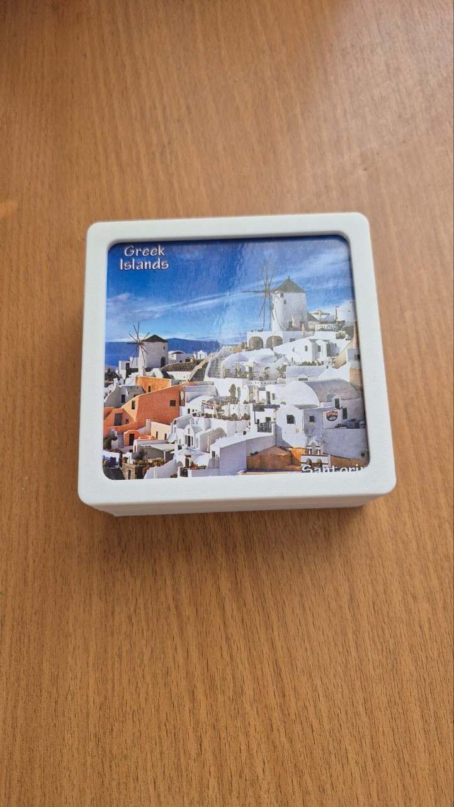
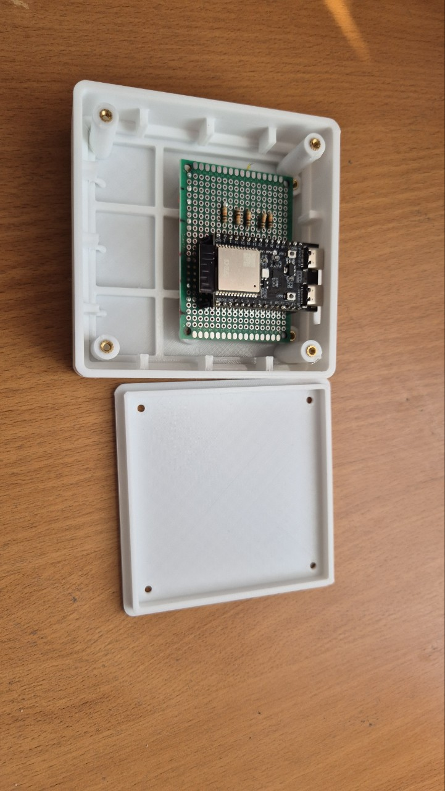

# Hot tea stand

## План оставшихся работ

1. Проверить работу датчиков и схемы: прозвонить соединения и допаять.
2. Поправить модель корпуса: исправить расположение отверстия для USB.
3. Подправить уже напечатанный корпус.
4. Отладить соединение с Zigbee-хабом SprutHub.
5. Дописать код для температурного графика.

Подставка под чашку с ESP32-C6 и NTC 3950. Структура обновлена 13 сентября 2026 года; геометрия не изменялась.

## Фотографии прототипа

Напечатанный корпус с декоративной накладкой:



Внутреннее размещение ESP32-C6 на проектной плате и снятая нижняя крышка:



## Структура

| Папка | Содержимое |
| --- | --- |
| [models/current](models/current/) | Последние модели 102 мм: исходная сборка `esp32_inverted_box_102mm_snap_lid.3dm` и результат вычитаний `esp32_inverted_box_102mm_final.3dm` |
| [models/archive](models/archive/) | Предыдущие версии 100 мм |
| [models/sketches](models/sketches/) | Рабочие эскизы `maket.3dm` |
| [models/templates](models/templates/) | Шаблон подрезки накладки 95 × 95 мм, R5 |
| [models/examples](models/examples/) | Пример прижима NTC к шайбе |
| [exports](exports/) | Сохранённые STL и 3MF; резервный STL — в `exports/archive/` |
| [scripts](scripts/) | Генерация моделей, вычитания и проверки |
| [code](code/) | Код для ESP32 и инструкция запуска |
| [docs](docs/) | Исторические заметки по корпусу и прижиму |
| [schematics](schematics/) | Схемы монтажа и макетной платы |
| [references](references/) | Фотографии и скриншоты |
| [photo](photo/) | Фотографии напечатанного прототипа и внутреннего монтажа |
| [archive/generated-cache](archive/generated-cache/) | Старый Python-кеш; для запуска не нужен |

## Актуальность файлов

`current` означает последние сохранённые файлы, а не новую проверку пригодности к печати. Соответствие `temp_box.stl` и `temp_box.3mf` последней модели не подтверждено. Ручная подрезка USB на напечатанном корпусе не означает, что CAD-файл исправлен.

Фактическая накладка оказалась размером 98 мм; отдельно сохранён шаблон подрезки до 95 мм, R5.

## Запуск скриптов

Из корня проекта:

```sh
python3 scripts/create_esp32_inverted_box_3dm.py
python3 scripts/finalize_esp32_box.py
python3 scripts/validate_esp32_box_3dm.py
python3 scripts/validate_esp32_box_final.py
```

Первые две команды перезаписывают исходную и финальную модели в `models/current/`. Перед запуском сохраняйте отдельную копию ручных изменений в Rhino: генераторы могут их не воспроизводить.

Отдельные генераторы:

```sh
python3 scripts/create_overlay_cut_template.py
python3 scripts/create_ntc_clamp_3dm.py
```

Результаты записываются в `models/templates/` и `models/examples/`. Пути вычисляются относительно скриптов и не зависят от текущей папки терминала.

Зависимости: `rhino3dm`, для операций с сетками также `numpy`, `trimesh`, `manifold3d`. Сохранены прежние дополнительные пути библиотек `/tmp/codex_rhino3dm` и `/tmp/codex_meshlibs`: это временные окружения, наличие библиотек там не гарантировано. При уборке проверен синтаксис скриптов; генерация и геометрические проверки не запускались.

## Документация и схемы

Скетч проверки пяти NTC на GPIO2–6: [code/ntc_test/ntc_test.ino](code/ntc_test/ntc_test.ino).
Подключение и запуск описаны в [code/README.md](code/README.md).

- [Заметки по корпусу](docs/README_esp32_box_ru.md) и [прижиму](docs/README_ntc_clamp_ru.md) сохранены как исторические документы: пути и размеры в них могут относиться к предыдущим итерациям.
- `schematics/esp32-perfboard-placement.html` — ранняя схема проектной платы.
- `schematics/esp32-final-perfboard-layout.html` — более поздний вариант размещения.
- `schematics/two-ntc-breadboard.html` — макет с двумя датчиками.

В схемах есть разные варианты делителя: резистор к 3V3 / NTC к GND и наоборот. Формула температуры должна соответствовать выбранному подключению. HTML сохранены как исходные фрагменты визуализаций.

Фотографии в `references/` собраны из обсуждения; их оригиналы по прежним адресам оставлены для сохранения ссылок в чате.
